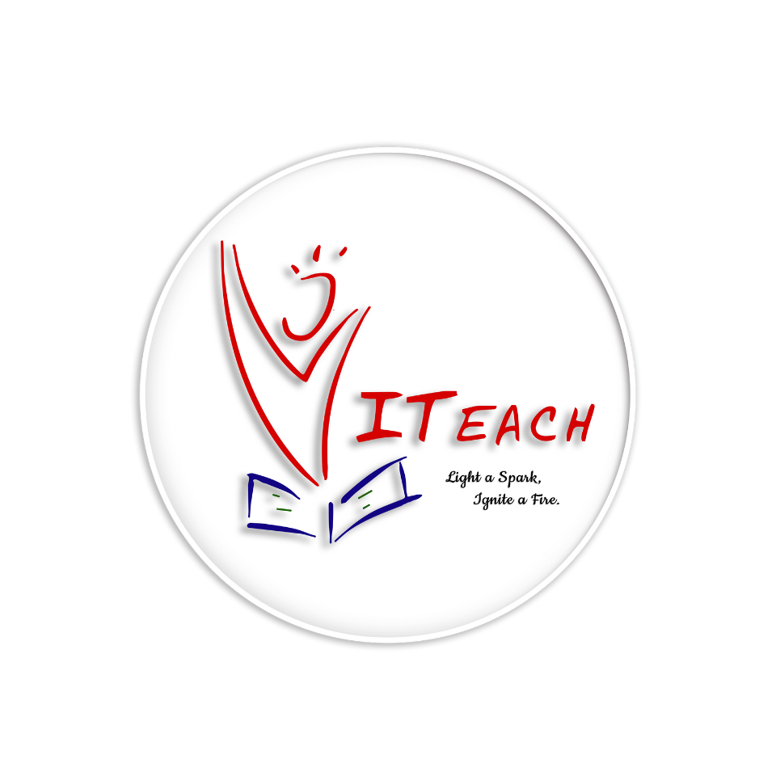

# 
 Project Title 💡 

# 
 **VITeach Learning App 📖 📱   Transforming Education Through Technology** :sparkles: 

## Overview 📔

  
VITeach is a non-profit organization founded and run by a group of motivated students from Vellore Institute of Technology, Chennai, who are driven by a passion for change. With an assortment of 161 active members, the club has been able to directly impact the lives of over 4,83,400 students along the years.

With 3 schools under the club, Adi Dravida Welfare (ADW) Middle School, Melakkottaiyur, and GHS Kandigai being its primary projects, the members of VITeach have worked around the clock to ensure that these children’s lives have been positively impacted.

## Vision and Mission 🎯

**Mission:** VITeach aims not only to teach the kids, but also to provide them with an environment where they can grow unhindered just like how a seed transforms into a young sapling with light, water, love, and care. Taking that extra effort is what VITeach is all about.

Since its inception in the year 2013, VITeach has evolved from a club that helped students with basic and conversational English in a single government school, to a club that has completed several projects with a focus on interactive learning. Now, it is emerging further to provide quality education through online resources.

  
**Vision:** VITeach seeks equal and quality education for all, especially for those who are denied equity in resources and opportunities. The organization has members from all branches of engineering and other majors like Law, MBA, etc. who have all come together to work for a common goal - the betterment of those less fortunate than themselves.

The club’s vision of bestowing underprivileged students an opportunity to get the resources they deserve and have a solid chance at contributing to society has ensured that VITeach has remained strong for 8 years and counting.

## Impact 💥

  
Since our inception, Viteach has reached thousands of learners across multiple regions, providing them with the tools and opportunities to succeed academically and professionally. Our programs have significantly improved literacy rates, enhanced vocational skills, and empowered individuals to pursue their goals with confidence.
  

## Get Involved 🧑‍🤝‍🧑

We invite educators, technologists, volunteers, and donors to join us in our mission to make quality education accessible to all. Together, we can create a brighter future for individuals and communities around the world.  

For more information about Viteach and how you can contribute, 🔗 [please visit our website](https://viteach.org.in/ "VITeach") ❤️

## Feedback 🗣️

If you have any feedback please reach out to us at [VITeach](viteach@gmail.com) ✅

## License ©️

[MIT](LICENSE.txt)

