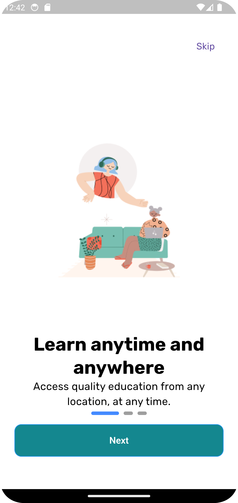
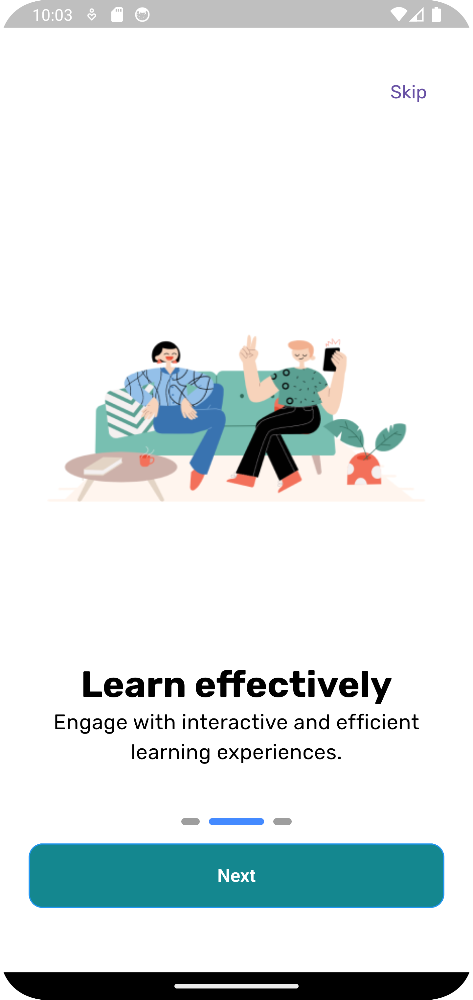
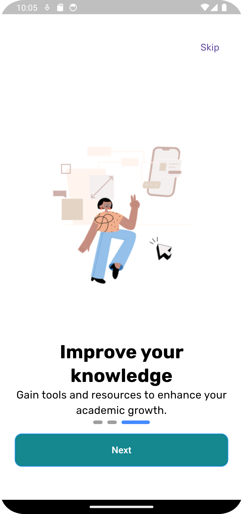
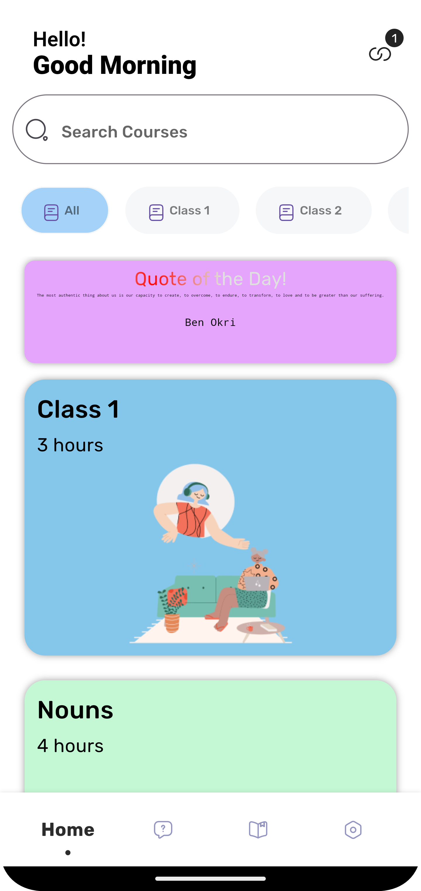
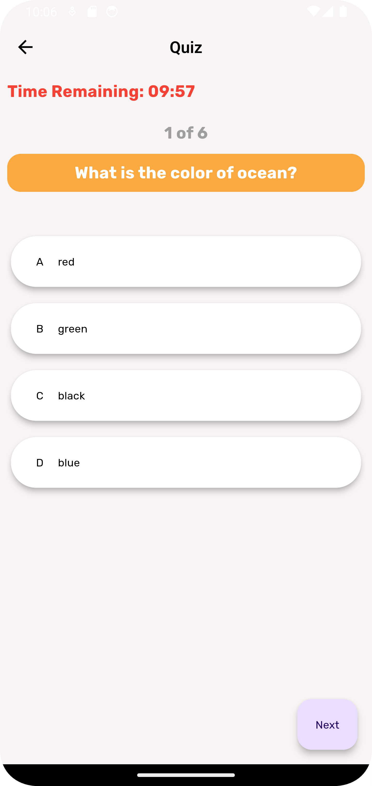
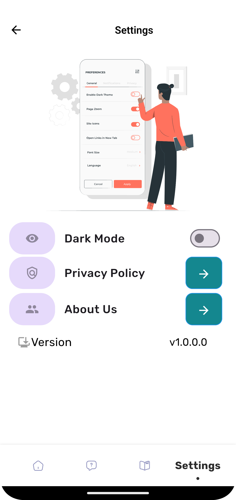

# <div align="center"> **VITeach Learning App 📖 📱** <br> Transforming Education Through Technology :sparkles: </div>

<div align="center">

</div>

## 🔶 Overview 📔

<div align="justify">
  
VITeach is a non-profit organization founded and run by a group of motivated students from Vellore Institute of Technology, Chennai, who are driven by a passion for change. With an assortment of 161 active members, the club has been able to directly impact the lives of over 4,83,400 students along the years.

With 3 schools under the club, Adi Dravida Welfare (ADW) Middle School, Melakkottaiyur, and GHS Kandigai being its primary projects, the members of VITeach have worked around the clock to ensure that these children’s lives have been positively impacted.

</div>

## 🔶 Vision and Mission 🎯

<div align="justify">

**Mission:** VITeach aims not only to teach the kids but also to provide them with an environment where they can grow unhindered just like how a seed transforms into a young sapling with light, water, love, and care. Taking that extra effort is what VITeach is all about.

Since its inception in the year 2013, VITeach has evolved from a club that helped students with basic and conversational English in a single government school to a club that has completed several projects with a focus on interactive learning. Now, it is emerging further to provide quality education through online resources.

</div>

<div align="justify">
  
**Vision:** VITeach seeks equal and quality education for all, especially for those who are denied equity in resources and opportunities. The organization has members from all branches of engineering and other majors like Law, MBA, etc. who have all come together to work for a common goal - the betterment of those less fortunate than themselves.

The club’s vision of bestowing underprivileged students an opportunity to get the resources they deserve and have a solid chance at contributing to society has ensured that VITeach has remained strong for 8 years and counting.

</div>

## 🔶 Impact 💥

<div align="justify">
  
Since our inception, VITeach has reached thousands of learners across multiple regions, providing them with the tools and opportunities to succeed academically and professionally. Our programs have significantly improved literacy rates, enhanced vocational skills, and empowered individuals to pursue their goals with confidence.
  
</div>

## 🔶 Get Involved 🧑‍🤝‍🧑

<div align="justify">
We invite educators, technologists, volunteers, and donors to join us in our mission to make quality education accessible to all. Together, we can create a brighter future for individuals and communities around the world. <br>

For more information about VITeach and how you can contribute, 🔗 [please visit our website](https://viteach.org.in/ "VITeach") ❤️

</div>

## 🔷 Features 🗒️

- Light/Dark Mode Toggle
- Simple UI/UX
- Access to Study Materials
- Cross-Platform

## :atom: Tech Stack Used 🧑‍💻

- Flutter
- Dart
- Firebase
- REST APIs

## 🔷 Optimizations ⭐

- Reusable Widgets
- State Management Tools like GETX, Providers

## Environment Variables

To run this project you will need these environment variables to add in your `secrets.dart`

- `"Your_API_KEY"`

## 💠 Screens 🫧

### Onboarding Screens:
1. **Learn Anytime and Anywhere:** 
   - Description: Access quality education from any location.
  - 
   
2. **Learn Effectively:**
   - Description: Interactive learning experiences to enhance understanding.
   - 
   
3. **Improve Your Knowledge:**
   - Description: Tools and resources to help you grow academically.
   - 

### Home Screen:
- **Greeting Message:** Displays a message like "Good Morning", "Good Afternoon", or "Good Evening" based on the time of day.
- **Search Bar:** Allows users to search for specific content or materials.
- **Daily Quotes:** Displays new motivational quotes every day.
- **Class and Subject Selection:** Students can choose classes or subjects to access relevant study materials.
- 

### Bottom Navigation Bar:
1. **Home:** 
   - Main dashboard with greeting, search, quotes, and class/subject selection.
   - 
   
2. **Quizzes:**
   - Various subject quizzes (English, Maths, Hindi, Science) with a timer.
   - Results screen and option to retake quizzes.
   - 
   
   
3. **Settings:**
   - Includes options for privacy policy, about us, and app version.
   - 


## 🟩 Areas to Improve 🆙

- Enhance user interactivity and engagement features.
- Expand the range of subjects and materials available.
- Integrate more languages to cater to diverse user groups.

## 💚 Bug fixes 🪲

- Fixed navigation issues between screens.
- Resolved quiz timer bugs.
- Improved loading times and reduced app crashes.

## 💟 Authors :octocat:

- [Vishnuppriyan]() <br>
- [Aditya Pandey]() <br>
- [Riya Kapoor]() <br>

## 🔷 How to Contribute? 🤔

We welcome contributions from the community. To contribute:

1. Fork the repository.
2. Create a new branch (`git checkout -b feature-branch`).
3. Make your changes.
4. Commit your changes (`git commit -m 'Add some feature'`).
5. Push to the branch (`git push origin feature-branch`).
6. Open a Pull Request.

## 🔷 Installation 🚀

1. Clone the repository:
  ```bash
  git clone https://github.com/your-repo/viteach-learning-app.git
2. Navigate to the project directory 
  ```bash
   cd viteach-learning-app
3. Install dependencies
   ```bash
   flutter pub get
4. Run the app
   ```bash
   flutter run


## 🔷 Feedback 🗣️

If you have any feedback please reach out to us at [VITeach](viteach@gmail.com "Gmail") ✅

## 🔴 License ©️

[](LICENSE.txt)

